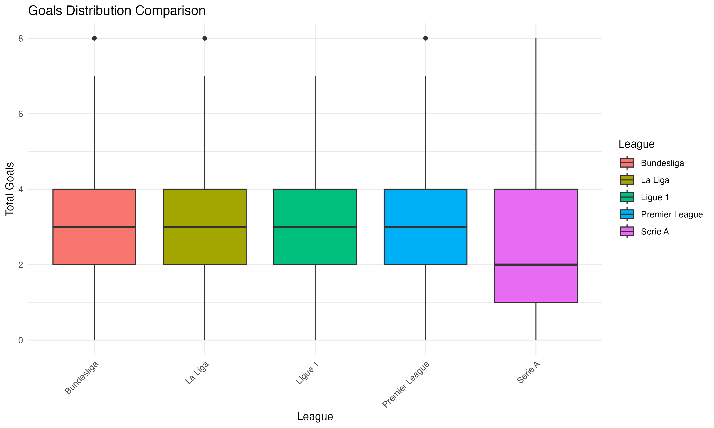
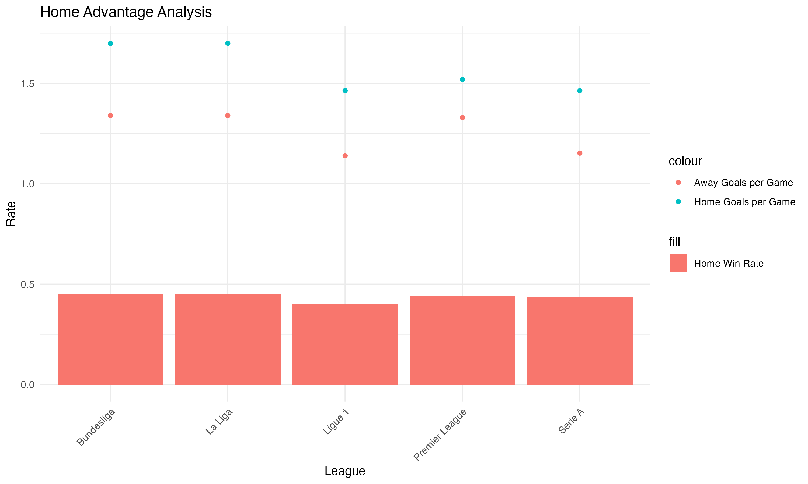
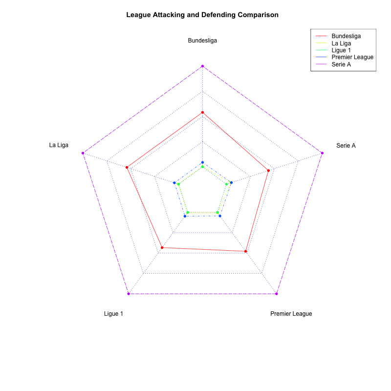
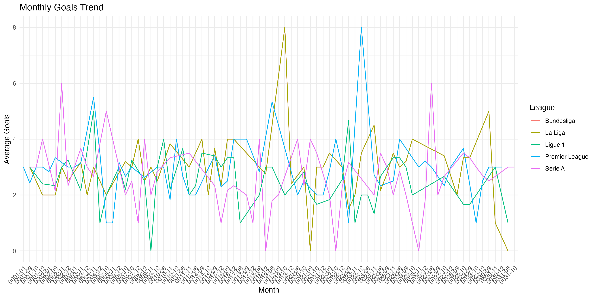
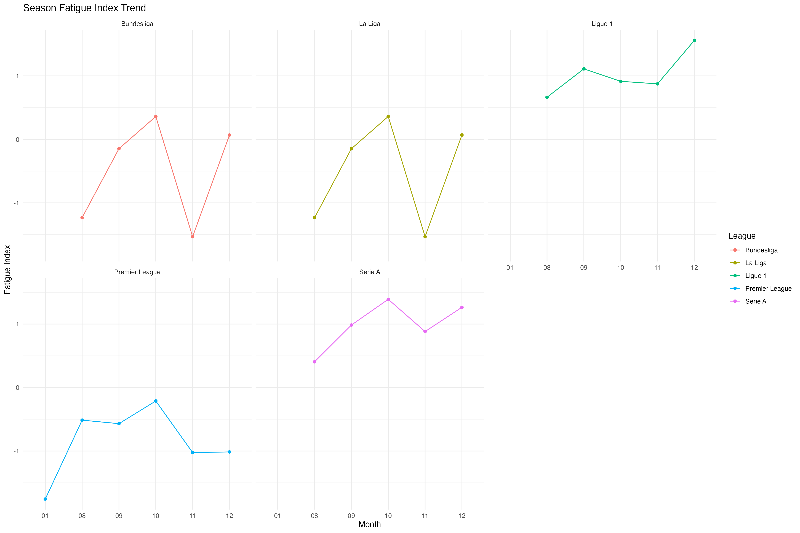

# In-Depth Analysis Report of Top 5 Soccer Leagues

## Table of Contents

1. [Overall League Overview](#overall-league-overview)

2. [Goals Analysis](#goals-analysis)

3. [Home Advantage Analysis](#home-advantage-analysis)

4. [Match Pattern Analysis](#match-pattern-analysis)

5. [Technical Metrics Analysis](#technical-metrics-analysis)

6. [League Feature Comparison](#league-feature-comparison)

7. [Temporal Trend Analysis](#temporal-trend-analysis)

8. [Special Match Patterns](#special-match-patterns)

9. [Summary and Insights](#summary-and-insights)

## Overall League Overview

### Bundesliga

- Total Matches: 153
- Total Goals: 465
- Average Goals per Match: 3.04
- Home Win Rate: 45.1%
- Draw Rate: 24.8%
- Away Win Rate: 30.1%

### La Liga

- Total Matches: 153
- Total Goals: 465
- Average Goals per Match: 3.04
- Home Win Rate: 45.1%
- Draw Rate: 24.8%
- Away Win Rate: 30.1%

### Ligue 1

- Total Matches: 179
- Total Goals: 466
- Average Goals per Match: 2.60
- Home Win Rate: 40.2%
- Draw Rate: 29.6%
- Away Win Rate: 30.2%

### Premier League

- Total Matches: 210
- Total Goals: 598
- Average Goals per Match: 2.85
- Home Win Rate: 44.3%
- Draw Rate: 20.0%
- Away Win Rate: 35.7%

### Serie A

- Total Matches: 190
- Total Goals: 497
- Average Goals per Match: 2.62
- Home Win Rate: 43.7%
- Draw Rate: 29.5%
- Away Win Rate: 26.8%

## Goals Analysis

### Goals Distribution

- Bundesliga's Goal Characteristics:
  - Average 3.04 goals per match
  - 35.9% of matches are high-scoring (4+ goals)
  - 14.4% of matches are low-scoring (0-1 goals)

- La Liga's Goal Characteristics:
  - Average 3.04 goals per match
  - 35.9% of matches are high-scoring (4+ goals)
  - 14.4% of matches are low-scoring (0-1 goals)

- Ligue 1's Goal Characteristics:
  - Average 2.60 goals per match
  - 27.9% of matches are high-scoring (4+ goals)
  - 24.6% of matches are low-scoring (0-1 goals)

- Premier League's Goal Characteristics:
  - Average 2.85 goals per match
  - 33.8% of matches are high-scoring (4+ goals)
  - 21.0% of matches are low-scoring (0-1 goals)

- Serie A's Goal Characteristics:
  - Average 2.62 goals per match
  - 28.9% of matches are high-scoring (4+ goals)
  - 26.8% of matches are low-scoring (0-1 goals)

## Home Advantage Analysis

- Bundesliga's Home Advantage:
  - Home Win Rate: 45.1%
  - Home Goal Efficiency: 3.04 per match
  - Home Possession Rate: 54.8%

- La Liga's Home Advantage:
  - Home Win Rate: 45.1%
  - Home Goal Efficiency: 3.04 per match
  - Home Possession Rate: 54.8%

- Ligue 1's Home Advantage:
  - Home Win Rate: 40.2%
  - Home Goal Efficiency: 2.60 per match
  - Home Possession Rate: 56.7%

- Premier League's Home Advantage:
  - Home Win Rate: 44.3%
  - Home Goal Efficiency: 2.85 per match
  - Home Possession Rate: 54.9%

- Serie A's Home Advantage:
  - Home Win Rate: 43.7%
  - Home Goal Efficiency: 2.62 per match
  - Home Possession Rate: 53.1%

## Technical Metrics Analysis

- Bundesliga's Technical Characteristics:
  - Average Shots per Match: 26.9
  - Shots on Target Rate: 35.4%
  - Corners: 10.3 per match
  - Fouls: 22.2 per match

- La Liga's Technical Characteristics:
  - Average Shots per Match: 26.9
  - Shots on Target Rate: 35.4%
  - Corners: 10.3 per match
  - Fouls: 22.2 per match

- Ligue 1's Technical Characteristics:
  - Average Shots per Match: 24.7
  - Shots on Target Rate: 33.7%
  - Corners: 9.7 per match
  - Fouls: 26.4 per match

- Premier League's Technical Characteristics:
  - Average Shots per Match: 25.0
  - Shots on Target Rate: 35.7%
  - Corners: 10.2 per match
  - Fouls: 21.2 per match

- Serie A's Technical Characteristics:
  - Average Shots per Match: 21.1
  - Shots on Target Rate: 50.3%
  - Corners: 10.6 per match
  - Fouls: 25.3 per match

## Temporal Trend Analysis

### Changes During the Season

### Season Fatigue Analysis

- Highest Season Stage for Fouls: October

- Highest Season Stage for Goals: November

## Special Match Patterns

- Bundesliga:
  - Clean Sheet Rate: 39.2%
  - High Score Rate: 35.9%
  - Comeback Rate: 4.6%

- La Liga:
  - Clean Sheet Rate: 39.2%
  - High Score Rate: 35.9%
  - Comeback Rate: 4.6%

- Ligue 1:
  - Clean Sheet Rate: 49.7%
  - High Score Rate: 27.9%
  - Comeback Rate: 3.9%

- Premier League:
  - Clean Sheet Rate: 46.2%
  - High Score Rate: 33.8%
  - Comeback Rate: 3.3%

- Serie A:
  - Clean Sheet Rate: 49.5%
  - High Score Rate: 28.9%
  - Comeback Rate: 2.6%

## Summary and Insights

### Summary of League Characteristics

- Premier League:
  - Characteristics: Offensive League
  - Strengths: Strong Home Advantage
  - Challenges: Stable Match Outcomes

- La Liga:
  - Characteristics: Offensive League
  - Strengths: Strong Home Advantage
  - Challenges: Stable Match Outcomes

- Bundesliga:
  - Characteristics: Offensive League
  - Strengths: Strong Home Advantage
  - Challenges: Stable Match Outcomes

- Serie A:
  - Characteristics: Defensive League
  - Strengths: Strong Home Advantage
  - Challenges: Unstable Match Outcomes

- Ligue 1:
  - Characteristics: Defensive League
  - Strengths: Balanced Home and Away
  - Challenges: Stable Match Outcomes

### Key Findings

1. Goal Characteristics:

   - League with Highest Goal Efficiency: Bundesliga

   - Most Stable League: Ligue 1

2. Match Patterns:

   - Most Entertaining League: Bundesliga (Based on High Goal Rate and Shots)

   - Most Intense League: Ligue 1 (Based on Fouls and Cards)

3. Special Findings:

   - League with Highest Comeback Rate: Bundesliga

   - League with Highest Clean Sheet Rate: Ligue 1

### Recommendations and Outlook

1. League Development Suggestions:

   - Strengthen offensive tactics

   - Balance home and away advantages

   - Enhance match entertainment value

2. Data Application Suggestions:

   - Analyze team tactical characteristics in depth

   - Optimize schedule arrangements

   - Improve refereeing standards

3. Future Research Directions:

   - Player performance data analysis

   - Tactical trend research

   - Cross-season comparative study

